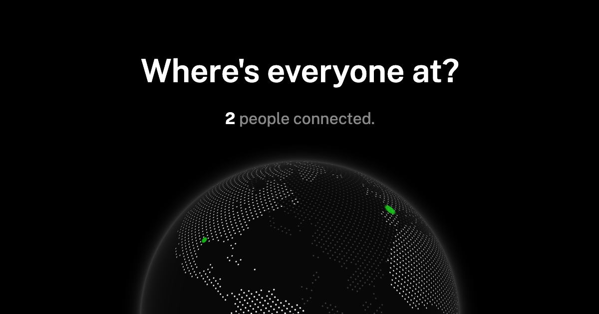

# Multiplayer Globe App with Nuxt

Display website visitor locations in real-time using [Nuxt](https://nuxt.com) and [NuxtHub](https://hub.nuxt.com).

[https://multiplayer-globe.nuxthub.workers.dev](https://multiplayer-globe.nuxthub.workers.dev)

<a href="https://multiplayer-globe.nuxthub.workers.dev">

</a>

## Credits

Inspired by <a href="https://github.com/cloudflare/templates/tree/main/multiplayer-globe-template">Cloudflare's multiplayer-globe-template</a>.

## Features

- Server-Side rendering on Cloudflare Workers
- ESLint setup
- Ready to add a database, blob and KV storage
- One click deploy on 275+ locations for free

## How it works

When the first request is made, the server store the user's location (latitude and longitude) using the [`useState`](https://nuxt.com/docs/api/composables/use-state) composable in the [`app/plugins/location.server.ts`](./app/plugins/location.server.ts) file.

A `/visitors` websocket endpoint is created in the [`server/routes/visitors.ts`](./server/routes/visitors.ts) file using the [`defineWebSocketHandler`](https://nitro.build/guide/websocket) function.

When the [`index.vue` page](./app/pages/index.vue) is mounted on client-side, it connects to the `/visitors` websocket endpoint with its location as query parameters to the server.

The websocket endpoints send back the user locations to the client-side.

## Setup

Make sure to install the dependencies with [pnpm](https://pnpm.io/installation#using-corepack):

```bash
pnpm install
```

## Development Server

Start the development server on `http://localhost:3000`:

```bash
pnpm dev
```

> [!TIP]
> A random location is generated in development as we don't have access to Cloudflare's geolocation data on the incoming request.

## Production

Build the application for production:

```bash
pnpm build
```

## Deploy

> [!IMPORTANT]
> We are currently working on the `nuxthub deploy` command deployment to CF Workers with Durable Objects, make sure to follow us on [X](https://x.com/nuxt_hub) or sign-up on [NuxtHub](https://admin.hub.nuxt.com) to know when the feature is out!

